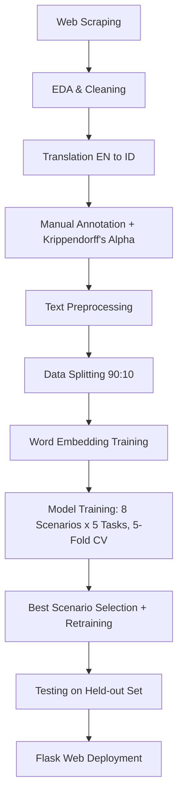

# HotelAnalyzer AI: Multilabel Aspect-Based Sentiment Analysis for Hotel Reviews

HotelAnalyzer AI reads hotel reviews in Indonesian or English and automatically detects **which aspects of the stay are discussed** (Room, Hotel, Location, Service) and **the sentiment toward each one**. It is the implementation of my undergraduate thesis: *"Komparasi Kinerja Model Deep Learning dan Word Embedding dalam Multilabel Aspect-Based Sentiment Analysis pada Ulasan Hotel Multilingual"* (Information Systems, UPN "Veteran" Jawa Timur).

The project covers the full ML lifecycle: web scraping → manual annotation with reliability testing → text preprocessing → custom word embedding training → systematic deep learning experimentation (40 trained models) → evaluation → deployment as a Flask web app with an analytics dashboard.

[](https://youtu.be/ZEX3dyADnYA)
*Click the thumbnail above to watch the full demo on YouTube.*

---

## Table of Contents

1. [What is ABSA?](#what-is-absa-example)
2. [Project Overview](#project-overview)
3. [Dataset](#dataset)
4. [Methodology Pipeline](#methodology-pipeline)
5. [Modeling Approach](#modeling-approach)
6. [Experimental Design and Results](#experimental-design-and-results)
7. [Test Set Generalization](#test-set-generalization)
8. [Web Application — Features & Charts](#web-application--features--charts)
9. [Tech Stack](#tech-stack)
10. [Repository Structure](#repository-structure)
11. [Installation and Usage](#installation-and-usage)
12. [Key Findings](#key-findings)
13. [Limitations and Future Work](#limitations-and-future-work)
14. [Author](#author)

---

## What is ABSA? (Example)

A star rating tells you *if* a guest was happy, not *why*. **Aspect-Based Sentiment Analysis (ABSA)** breaks a review down into the specific things being talked about and the sentiment toward each one. Because a single review can cover several topics at once, this project uses **multilabel ABSA** — one review, multiple aspects, each with its own sentiment.

Example input:

> *"The room was extremely dirty, with numerous stains on the table, linens, and curtains. The hotel parking area was also very limited. Fortunately, the location is strategic, right in front of Tunjungan Plaza, so there are many interesting places to visit."*

HotelAnalyzer AI output:

| Aspect | Discussed? | Sentiment |
|---|---|---|
| Room | Yes | **Negative** (dirty, stained) |
| Hotel | Yes | **Negative** (limited parking) |
| Location | Yes | **Positive** (strategic, near attractions) |
| Service | No | — |

This is what the models are trained to reproduce automatically, at scale, across thousands of reviews.

---

## Project Overview

The system is a **two-stage pipeline**:

1. **Task 1 — Aspect Detection** (multilabel classification): predicts which of Room / Hotel / Location / Service are mentioned in a review.
2. **Tasks 2–5 — Aspect Sentiment Classification** (binary): for every aspect detected in Task 1, a dedicated model predicts Positive or Negative sentiment.

The core research contribution is a **systematic comparison**: 2 architectures (CNN, BiLSTM) × 2 custom word embeddings (Word2Vec, FastText) × 2 preprocessing variants (stemmed, non-stemmed) = **8 scenarios**, each trained for all **5 tasks** with 5-Fold Cross Validation — **40 models total**. The winning configuration per task was retrained and deployed into the **HotelAnalyzer AI** Flask app.

---

## Dataset

| | |
|---|---|
| Source | Tripadvisor, via Apify web scraping |
| Regions | Bali, Surabaya, Sukabumi (Indonesia's top hotel-density provinces) |
| Size | **7,821 reviews**, 0 missing values, 0 duplicates |
| Avg. review rating | 3.82 / 5 (skewed positive) |
| Region split | Bali 3,942 · Surabaya 2,810 · Sukabumi 1,069 |

**Aspect sentiment distribution:**

| Aspect | Positive | Negative |
|---|---|---|
| Room | 1,595 | **1,812** (most complaints) |
| Hotel | 2,001 | 1,280 |
| Location | **2,039** (most praised) | 603 |
| Service | 1,784 | 995 |

**Labeling reliability:** 3 independent human annotators, final label via majority voting, agreement measured with **Krippendorff's Alpha** (nominal scale): Room 0.928, Hotel 0.879, Location 0.891, Service 0.882, **overall 0.896** — indicating strong, reliable annotation.

---

## Methodology Pipeline
The research follows nine sequential stages, grouped into three phases:

**Phase 1 — Data Preparation**
1. **Web Scraping** — collect hotel reviews from Tripadvisor via Apify (Bali, Surabaya, Sukabumi).
2. **EDA & Cleaning** — inspect data quality, remove duplicates/short reviews.
3. **Translation** — convert English reviews to Indonesian for consistent processing.
4. **Manual Annotation** — 3 independent annotators label each aspect (Positive/Negative/None), validated with Krippendorff's Alpha.
5. **Text Preprocessing** — cleaning, case folding, normalization, stopword removal, and stemming, kept as two parallel versions (stemmed & non-stemmed).
6. **Data Splitting** — 90:10 split using iterative stratification, then divided into per-task subsets (1 aspect + 4 sentiment).

**Phase 2 — Modeling**
7. **Word Embedding** — train custom Word2Vec and FastText models (Gensim) on the hotel-review domain.
8. **Model Training & Selection** — train 8 scenarios (CNN/BiLSTM × Word2Vec/FastText × stemmed/non-stemmed) for all 5 tasks with 5-Fold CV, select the best scenario per task by F1 Macro, then retrain on the full training set.
9. **Testing** — evaluate the retrained models on a held-out test set to confirm generalization.

**Phase 3 — Deployment**
10. **Web Deployment** — integrate the 5 best models into a Flask application with an automated inference pipeline and analytics dashboard.

Key implementation choices:
- **Annotation before preprocessing** to keep the raw context intact for labeling.
- **Iterative Stratification** (`MultilabelStratifiedShuffleSplit`) for the 90:10 split, since the task is multilabel — keeps label balance fair across train/test and avoids leakage.
- **Parallel stemmed / non-stemmed pipelines**, since prior literature disagrees on whether stemming helps — this project tests it empirically instead of assuming.
- **Custom-trained embeddings** (not generic pretrained vectors) — Word2Vec & FastText, skip-gram, vector size 100, trained directly on the hotel-review domain, used as non-trainable weights so every scenario is compared fairly.

---

## Modeling Approach

- **CNN** — Kim (2014)-style architecture: three parallel Conv1D layers (kernel sizes 3/4/5) → max pooling → concatenation → dense + dropout → sigmoid output. Strong at picking up local, keyword-driven sentiment patterns.
- **BiLSTM** — bidirectional LSTM layer capturing two-directional sequential context → dropout → dense → sigmoid output. Strong at modeling relationships between multiple aspects in one sentence.
- Both use Adam optimizer, Binary Cross-Entropy loss, identical hyperparameters across scenarios for a fair comparison.

---

## Experimental Design and Results

8 scenarios (Architecture × Embedding × Preprocessing) tested per task with 5-Fold CV, selected by highest F1 Macro:

| Task | Winning Scenario | F1 Macro (CV) |
|---|---|---|
| Task 1 — Aspect (multilabel) | BiLSTM + FastText + Stemmed | 97.02% |
| Task 2 — Sentiment: Room | CNN + FastText + Stemmed | 97.84% |
| Task 3 — Sentiment: Hotel | BiLSTM + Word2Vec + Non-Stemmed | 96.56% |
| Task 4 — Sentiment: Location | CNN + Word2Vec + Non-Stemmed | 97.37% |
| Task 5 — Sentiment: Service | CNN + Word2Vec + Stemmed | 97.96% |

For Task 1, all 8 scenarios scored 96.4–97.0% F1 Macro — close on the surface, but **Hamming Loss** and **Subset Accuracy** (all 4 aspects correct at once) separated them clearly: BiLSTM scenarios reached >91.3% subset accuracy vs. ≤90.3% for CNN. The "Hotel" aspect was consistently the hardest to detect (~92–94% F1) due to its broad vocabulary (pool, gym, lobby, décor, parking, etc.), while Room, Location, and Service each scored 97–99% F1.

**Comparison takeaways:**
- **No single configuration wins every task** — best setup depends on the task.
- **BiLSTM > CNN for multilabel aspect detection** (better at relating multiple aspects in one sentence); **CNN > BiLSTM for 3 of 4 sentiment tasks** (better at local keyword patterns).
- **Word2Vec > FastText for Hotel/Location/Service sentiment**; roughly tied for aspect detection and Room sentiment.
- **Stemming helps CNN fairly consistently, but has little or inconsistent effect on BiLSTM** — confirming it should be tested, not assumed.

---

## Test Set Generalization

The 5 winning models were retrained on the full training set and evaluated once on a held-out test set never used during training or model selection:

| Model | F1 Macro (CV) | F1 Macro (Test) | Δ |
|---|---|---|---|
| Aspect (Task 1) | 97.02% | 97.25% | +0.23% |
| Room (Task 2) | 97.84% | 98.82% | +0.98% |
| Hotel (Task 3) | 96.56% | 95.16% | −1.40% |
| Location (Task 4) | 97.37% | 96.76% | −0.61% |
| Service (Task 5) | 97.96% | 97.25% | −0.71% |

All gaps stay under 1.5%, indicating **no overfitting** and good generalization to unseen reviews.

---

## Web Application — Features & Charts

Built with **Flask** (backend) + **HTML / CSS / JavaScript / Bootstrap 5** (frontend). The five saved `.h5` models and two `.pkl` tokenizers are loaded once and chained into a single inference pipeline: **language detection → translation (if needed) → preprocessing → aspect detection → per-aspect sentiment classification → results**.

### Pages

| Page | What it does |
|---|---|
| **Beranda (Home)** | Introduces the system, the 4 aspects analyzed, and the tech stack. |
| **Analisis Teks** | Paste one review, get instant aspect + sentiment breakdown (see the ABSA example above). |
| **Analisis File** | Upload a CSV/Excel of many reviews for batch processing; results shown in a searchable, sortable, paginated table. |
| **Dashboard** | Aggregated visual analytics computed from batch results (see charts below). |

### Charts in the Dashboard

| Chart | Shows | Why it matters |
|---|---|---|
| **Aspect Distribution** | How many uploaded reviews mention each aspect (Room / Hotel / Location / Service) | Reveals what guests talk about most — where attention/resources should focus. |
| **Sentiment Comparison per Aspect** | Positive vs. Negative counts side-by-side for each aspect | Immediately flags which aspect is a strength (e.g. Location) vs. a weak point (e.g. Room). |
| **Sentiment Trend Over Time** | Positive/negative volume per aspect plotted across review dates | Tracks whether a problem (e.g. room cleanliness) is improving, worsening, or tied to a specific period/renovation. |
| **Per-Aspect Deep Dive: Sentiment Proportion** | Positive vs. negative share for one selected aspect | Quick focused view when drilling into a single aspect from the summary dashboard. |
| **Per-Aspect Deep Dive: Top Words** | Most frequent words in positive vs. negative reviews for that aspect | Turns a sentiment label into an actionable reason — e.g. "dirty", "small" for Room negatives; "clean", "spacious" for positives. |
| **Per-Aspect Deep Dive: Sentiment Trend** | Same trend view as above, scoped to one aspect | Lets a manager check whether a fix targeting one aspect actually shifted guest sentiment over time. |

Together, these give hotel managers a path from **raw reviews → what's being talked about → is it good or bad → is it changing over time → what specific words explain it** — without reading every review manually.

---

## Tech Stack

| Layer | Tools | Purpose |
|---|---|---|
| Scraping | Apify (Tripadvisor Reviews Scraper) | Collect raw reviews from Tripadvisor |
| Data processing | Python, Pandas, NumPy | Cleaning, merging, EDA |
| Language handling | `langdetect`, `googletrans` / Google Translate API, `deep-translator` | Detect + translate EN reviews (offline for training, on-the-fly for the web app) |
| Text preprocessing | `re`, Sastrawi, `indoNLP`, custom + `kamusalay` dictionaries, NLTK | Cleaning, case folding, normalization, stopwords, stemming |
| Embeddings | Gensim (Word2Vec, FastText) | Domain-specific vector representations of hotel-review vocabulary |
| Modeling | TensorFlow / Keras | CNN and BiLSTM classifiers |
| Data splitting | `iterative-stratification` | Multilabel-aware, leakage-free train/test split |
| Evaluation | Scikit-learn | F1, Precision, Recall, Hamming Loss, AUC-PR, confusion matrix |
| Training environment | Google Colaboratory (GPU) | Model training/experimentation |
| Deployment | Flask, HTML/CSS/JS, Bootstrap 5 | Web app backend + frontend |

---

## Repository Structure

```
ABSA_Hotel_Reviews_DeepLearning/
├── 01_Data_Merging_fixed.ipynb          # Merge scraped data (Bali, Surabaya, Sukabumi)
├── 02_EDA.ipynb                         # Exploratory Data Analysis
├── 03_Data_Cleaning.ipynb               # Missing values, duplicates, short reviews
├── 04_Translate.ipynb                   # Language detection + EN→ID translation
├── 05_1_Dataset_Pelabelan_Data.ipynb    # Annotation setup / majority voting
├── 05_2_Uji_Reliabilitas_Anotator_Krippendorff's_Alpha.ipynb
├── 06_Text_Preprocessing.ipynb          # Cleaning → stemming pipeline
├── 07_Train_WordEmbedding.ipynb         # Custom Word2Vec & FastText training
├── 08_Split_Tokenizer.ipynb             # Stratified split + tokenizers
│
├── TrainingModel/
│   ├── 10_Training_Task1_Aspek.ipynb    # 8-scenario, 5-fold CV training per task
│   ├── 10_Training_Task2_Room.ipynb
│   ├── 10_Training_Task3_Hotel.ipynb
│   ├── 10_Training_Task4_Location.ipynb
│   ├── 10_Training_Task5_Service.ipynb
│   └── Retraining_Model.ipynb           # Retrain best scenario on full train set
│
├── Evaluation/
│   └── Evaluasi_Model_Final.ipynb       # Test-set evaluation, confusion matrices, error analysis
│
├── HotelReviews_Analyzer/               # Flask web application
│   ├── app.py
│   ├── models/                          # task1_aspek.h5 ... task5_service.h5
│   ├── tokenizers/                      # tokenizer_stem.pkl, tokenizer_nonstem.pkl
│   ├── templates/
│   ├── utils/
│   ├── requirements.txt
│   └── README_INSTALASI.md
│
└── README.md
```

---

## Installation and Usage

```bash
git clone https://github.com/NavyNurlyn/ABSA_Hotel_Reviews_DeepLearning.git
cd ABSA_Hotel_Reviews_DeepLearning/HotelReviews_Analyzer

python -m venv venv
source venv/bin/activate        # Windows: venv\Scripts\activate

pip install -r requirements.txt
python app.py
# → open http://127.0.0.1:5000
```

For a detailed step-by-step guide, see [`HotelReviews_Analyzer/README_INSTALASI.md`](HotelReviews_Analyzer/README_INSTALASI.md). To reproduce the research pipeline from raw data, run notebooks `01`–`08`, then `TrainingModel/`, then `Evaluation/Evaluasi_Model_Final.ipynb`.

---

## Key Findings

1. **Location is the strongest asset, Room the biggest pain point** across 7,821 reviews.
2. **No universally best model** — the ideal architecture/embedding/preprocessing combination is task-dependent.
3. **BiLSTM suits multilabel aspect detection; CNN suits sentiment polarity.**
4. **Word2Vec generally edges out FastText** for per-aspect sentiment.
5. **Stemming is not a free win** — helps CNN, largely neutral for BiLSTM.
6. **All 5 deployed models generalize well** (train/test gap < 1.5%, F1 Macro 95–99% on unseen data).

---

## Limitations and Future Work

1. Only CNN and BiLSTM compared — Transformer/BERT-based models could better handle sarcasm and implicit criticism.
2. Data from a single platform (Tripadvisor) and 3 regions — broader sources would improve generalization.
3. Manual annotation by 3 human annotators — active learning or LLM-assisted labeling could scale this.

---

## Author

**Navy Nurlyn Ajrina** — Information Systems, Faculty of Computer Science, Universitas Pembangunan Nasional "Veteran" Jawa Timur.
Advisors: Eka Dyar Wahyuni, S.Kom., M.Kom. · Reisa Permatasari, S.T., M.Kom.

- GitHub: [@NavyNurlyn](https://github.com/NavyNurlyn)
- Repository: [ABSA_Hotel_Reviews_DeepLearning](https://github.com/NavyNurlyn/ABSA_Hotel_Reviews_DeepLearning)
